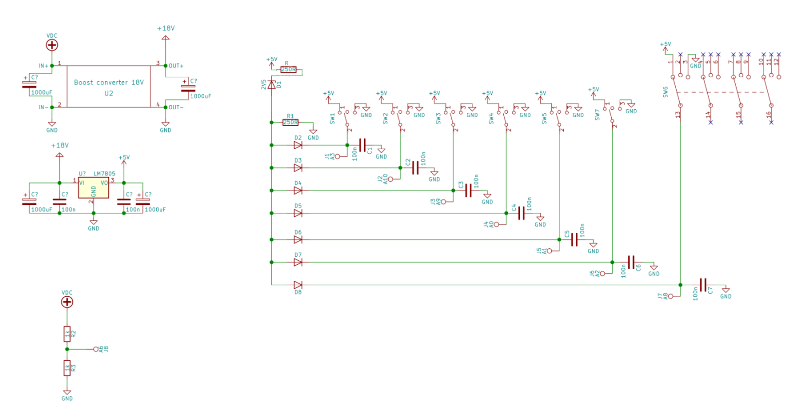
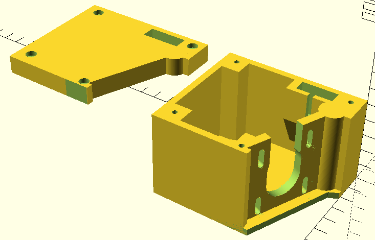
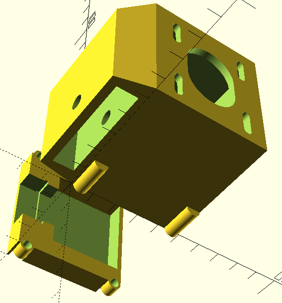
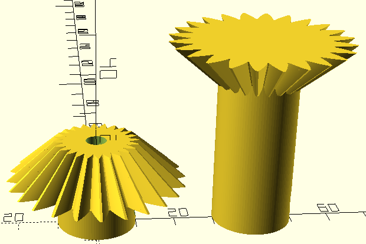

## Have to buy: ##

* Stepper motor: 
  * Choose with lowest coil resistance and lowest design voltage
  * tourque about 3Nm or greater
  * rather 400 steps than 200
* Display: 4-digit, 7-segment driven by TM1637
* Motor driver:
  * recommended with 1/16, 1/32 or 1/128 step resolution
  * have to provide at least design current of motor
  * have to tolerate at least 2x of motor design voltage, recommended 10x
* Arduino: Leonardo-compatible is enough, I used Blue Pro Micro
* Other:
  * 5 monostable lever switch, type: ON-OFF-ON
  * 1 rotary switch with 3 positions
  * copper cable:
    * few meters to connect driver to power supply (depends on current)
    * few meters to connect driver to stepper motor (depends on current, 0,5mm^2 should be enough in most cases)
  * 2 banana plug for power supply
  * 1 DIN-5 socket and plug
  * 1 zener diode 2-3V
  * 6 general purpose silicon diode with low reverse current
  * 6 ceramic capacitors (not necessary)
  * motor flexible clutch
  * two cases

## Schema: ##

## My choices ##
* [Flexible clutch 6,35/5mm](https://static1.redcart.pl/templates/images/thumb/995/1500/1500/pl/0/templates/images/products/995/adc648671c8d53c314f9d0aac80086b8.jpg)
* [Motor SM-42BYH1684](https://botland.com.pl/silniki-krokowe/10892-silnik-krokowy-sm-42byh1684-400-krokowobr-28v-168a-048nm.html)
* [Motor driver](https://www.pololu.com/product/2970)
* [Display](https://botland.com.pl/wyswietlacze-segmentowe-led/5973-modul-4x-wyswietlacz-7-segmentowy-interfejs-cyfrowy.html)
* Blue Pro Micro
* power supply from 6V 4,5Ah AGM battery (schema in separate repo soon)

## 3D models: ##

gears are for 90 deg. transmission, holes are for molex 8981 plugs 

